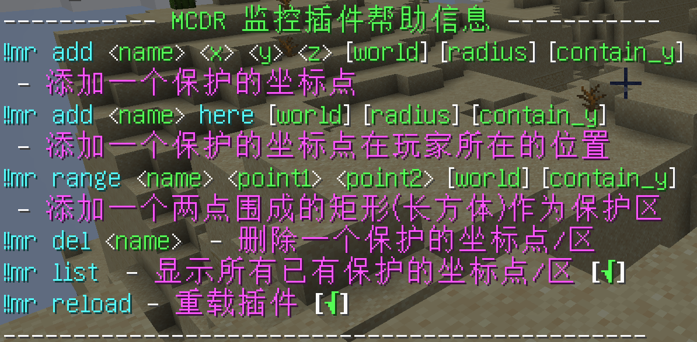

# MonitorR

一款定时获取在线玩家位置进行记录，同时设定禁区，若玩家被检测到处于禁区中，则全服广播提示并记录的插件。  

本插件功能性思路出自[Monitor](https://github.com/W-Kazdel/Monitor)，但由于后者存在一些功能性bug，并且没有很友好的用户体验，因此进行重制。  

插件会识别bot，并且`不会`对bot的位置进行记录和判断。  

中文 | [English](README.md)  

## 用法

!!mr 或者!!mr help获取帮助文本  

  

各参数细节可以在游戏里把鼠标移到文本上查看具体描述！  

## 安装

将插件代码`monitor.py`文件下载至MCDR的`plugins`目录中，注意插件需要MCDRv1.3及以上版本支持。  

插件依赖MinecraftDataAPI，详见[MinecraftDataAPI](https://github.com/MCDReforged/MinecraftDataAPI/blob/master/README_cn.md)  

推荐使用`ujson`第三方json库，其IO效率远高于默认`json`库2个数量级。不过即便没有安装，插件也会默认使用`json`标准库。  

## 配置介绍

第一次启用插件会在MCDR的`config`目录生成默认的配置文件夹以及配置文件。  

配置文件的路径为`config/monitor_reforged/config.json`，其内容为：  

```
{
    "interval": 15,
    "permissions": {
        "add": 3,
        "del": 3,
        "list": 1,
        "range": 3,
        "reload": 3
    },
    "point": {
        "radius": 200,
        "contain_y": false,
    },
    "range": {
        "contain_y": false,
    }
}
```

其中，`interval`表示最小的重复获取所有玩家位置的时间周期，单位为秒。`interval`并不是严格准确的时间周期，这是因为在小规模时间里多次获取玩家的位置信息会造成局部时间的卡顿。因此，在每次开始获取全部玩家信息时，每获取一个玩家的信息都会主动等待200毫秒。最终累计计算等待的时间，用这个最小时间减去总等待时间，再主动等待差值时间，然后开始下一次获取全部玩家的循环。这里时间并非严格的原因有二，一是计算等待时间的算式只是简单的累加了sleep的时间，并没有把IO操作以及获取玩家信息的时间计算在内；二是如果玩家数很多的话，实际时间周期必然会超过配置文件中指定的时间周期。比如当服务器在线玩家数超过了75人，那么仅仅是每次获取每一个玩家信息的等待时间累计起来就超过了默认的15秒。这个时候如果设置依然保持15秒的话，程序就会忽略这个15秒的最小时间要求，严格依赖获取每一个玩家的信息的等待时间累计。最终表现为程序循环获取全部玩家信息的循环之间没有延迟，仅有前后两次获取不同玩家的200毫秒延迟。  

`permissions`项有很多子项，分别表示每个命令所需的MCDR权限级别。详见[MCDR的Permission](https://mcdreforged.readthedocs.io/en/latest/permission.html)  

`point`项的子项表示对保护点的配置。其中`radius`表示默认的保护点半径，注意这里的配置项仅表示在生成保护点时若不指定`radius`参数应当使用的半径默认值，实际上当你用该默认值生成了一个保护点，之后改掉这个默认值，这个保护点的值并`不会`随着你的修改而修改，而是依旧保持先前的默认值。`contain_y`也表示默认是否计算y坐标，同`radius`，在生成保护点之后修改默认值`不会`导致先前的默认值被修改。  

`range`项的子项表示对保护区的配置。其中，`contain_y`表示默认是否计算y坐标，同`point`项的`radius`，在生成保护区之后修改默认值`不会`导致先前的默认值被修改。  

如果需要修改已创建的坐标点/区的信息，可参见下节`生成文件`，直接修改`site.json`文件。不过，此处更推荐删除保护点/区后重新创建。  

## 生成文件

初次运行插件后，插件会在MCDR的`config`目录生成自己的插件目录，名称为`monitor_reforged`。该目录中含有文件`config.json`、`site.json`以及`log`文件夹。  

关于`config.json`的内容参见上节。

`site.json`中储存着全部保护点/区的信息。下面根据一个示例对该文件进行解析：  

```
[
    {
        "type": "point",
        "name": "test",
        "x": 100,
        "y": 60,
        "z": 100,
        "world": "minecraft:overworld",
        "radius": 200,
        "contain_y": false
    },
    {
        "type": "range",
        "name": "test2",
        "x1": 100,
        "y1": 60,
        "z1": 100,
        "x2": 200,
        "y2": 60,
        "z2": 200,
        "world": "minecraft:overworld",
        "contain_y": false
    }
]

```

可以看到，这个json文本实际上是dict的list。  

每一个dict中都有`type`项，其取值有二：`point`和`range`。用来区分是保护点还是保护区。  

每个保护点/区都包含`name`属性，用作唯一标识符。  

每个保护点/区都包含`world`属性，表示这个保护点/区位于的世界维度。  

每个保护点/区都包含`contain_y`属性，表示这个保护点/区是否计算y坐标。  

而由于保护点是一个点，因此只需要储存`x`、`y`、`z`坐标三元组即可。  

保护点独有的`radius`表示用于警示区的半径范围。  

保护区是一个矩形（长方体），因此可以用两个角点来表示。所以储存了两个`x`、`y`、`z`坐标三元组。需要注意的是，保护区储存的两个三元组坐标并不一定是设置的时候输入的参数。因为构成同一个矩形（长方体）的角点可以有多对，因此记录只会记录主对角线上的一对角点。直观来看，第一组坐标三元组的三个坐标均为较小值，而第二组坐标的三元组三个坐标均为较大值。代码层面上，这样可以简化判断的流程，使得判断逻辑更快且更简单。如果需要修改这部分内容，请保证依然满足主对角线的角点特征，否则会导致代码层面的逻辑判断错误。  

`log`文件夹负责保存玩家的坐标记录，具体保存在`log.json`文件中，方便后续复查（或者一些别的用途，比如定小天才的罪）。同时记录玩家处于保护点附近或者保护区内时的告警。每次载入插件（启动MCDR、重载插件等）时会对当前已有的记录文件按照当前时间进行改名，防止一个文件过大。这里需要注意的是，每个记录文件虽然是json文件，但是里面的文本并非严格的json文本，实际上里面的文本是以换行划分，每一行是一条json文本。如果需要解析请务必注意。